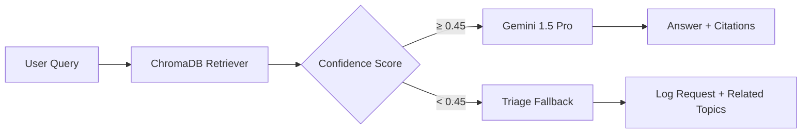

# 🤖 Ask Chipathon

**Ask Chipathon** is a Gemini-powered RAG (Retrieval-Augmented Generation) chatbot that answers questions about the Chipathon and OpenROAD flows, with citations to exact documentation sections and GitHub threads.

---

## CLI Usage

```bash
# Install and activate environment
uv venv && source .venv/bin/activate
uv pip install -e .

# First: ingest all documentation into the knowledge base
chipathon-ingest

# Then ask questions
ask-chipathon "How do I fix setup timing violations?"
ask-chipathon "Where is the final GDS file after the flow?"
ask-chipathon "What does CORE_UTILIZATION control?"
ask-chipathon "My router is hanging — what should I check?"
```

### Example Output

```
╭─ Ask Chipathon ─────────────────────────────────────────────────────────────╮
│ Query: How do I fix setup timing violations?                                │
╰─────────────────────────────────────────────────────────────────────────────╯

📖 Retrieved 4 relevant sources (confidence: 0.72)

Setup timing violations (negative WNS) can be addressed through:

1. **Enable routability-driven placement**: Set `GPL_ROUTABILITY_DRIVEN = 1`
   in your config.mk before re-running placement.

2. **Post-route optimization**: Add `DPO_MAX_DISPLACEMENT = 5 5` to allow
   detailed placement optimization after routing.

3. **Relax clock period**: Increase `CLOCK_PERIOD` in config.mk by 0.2 ns
   increments until timing closes, then tighten.

4. **Analyze the critical path**: Run:
   `report_timing -path_delay max -endpoint_count 10`

📎 Sources:
  [1] docs/debugging-playbook.md#timing-failures
  [2] OpenROAD GitHub Issue #4521 — "Setup violations after CTS"
  [3] ORFS README.md#configuration-options
  [4] OpenROAD Docs — Global Placement Options
```

---

## When Confidence is Low

When the chatbot cannot find a reliable answer, it returns a structured triage response instead of guessing:

```
⚠️  Low confidence (0.21) — I don't have a reliable answer for this.

To get help from mentors, please share:
  □ The last 30 lines of your relevant stage log:
    tail -30 flow/logs/<pdk>/<design>/5_1_grt.log
  □ Your config.mk (especially CLOCK_PERIOD, CORE_UTILIZATION)
  □ The exact error message or metric values

→ Related topics that might help:
  • Debugging routing failures
  • Understanding routing congestion
```

---

## Architecture



---

## Interactive Web UI

The **Ask Chipathon AI** is fully integrated directly into this documentation site! 

You can access it from any page by clicking the floating **🤖 Ask Chipathon AI** button located in the bottom right corner of your screen. Ask it any questions you have while browsing the guides, and it will keep your chat history open as you navigate between different pages.
